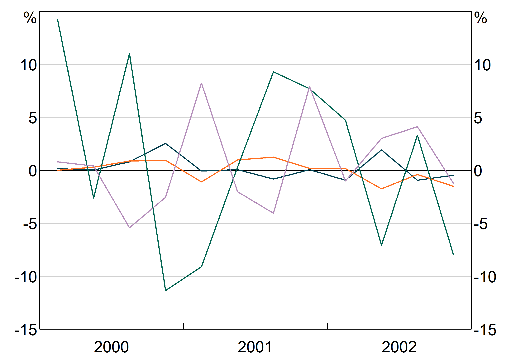

# Quick links

 - [Index](index.html)
 - [Getting started](getting-started.html)
 - [Plotting options](plotting-options.html)
 - [Colour palette](rba-colours.html)
 - [Package documentation (pdf)](https://angusmoore.github.io/arphit/arphit.pdf)

# Introduction

This document outlines all of the plotting options in `agg_qplot` and how to use them.
Examples are included of output, along with explanations.

A word of warning:`agg_qplot` has many features, despite being for quick plots. But, if you're graph is complex, you should use `arphitgg`. It's much easier to use (no lists of lists) and much easier to read the code.

# Data and types of graphs

The most important input to `arphit` is data.

Data can be a `tibble`, a `data.frame` or a `ts`. (For more details on the `ts` class see [https://stat.ethz.ch/R-manual/R-devel/library/stats/html/ts.html].)

Please note, unless otherwise specified, the examples in this vignette use the following randomly constructed time
series:
```{r}
data <- ts(data.frame(x1 = rnorm(12),
                      x2 = rnorm(12),
                      x3 = rnorm(12, sd = 10),
                      x4 = rnorm(12, sd = 5)),
           start = c(2000,1),
           frequency = 4)
```

## Specifying data

The data is the first argument to an `agg_qplot` call. Calling `agg_qplot` is as simple as:
```{r, eval = FALSE}
agg_qplot(data)
```
```{r, echo = FALSE, results = "hide"}
library(arphit)
agg_qplot(data, filename = "data_1.png")
```
```{r, out.width = "50%", echo = FALSE, fig.align="center"}

```

## Types of graphs and data

### Time series

Giving `arphit` a `ts`, `xts` or `zoo` object will automatically produce a time series plot:
```{r, eval = FALSE}
mytsdata <- ts(data.frame(x1 = rnorm(10)), frequency = 4, start = c(2000, 1))
agg_qplot(mytsdata)
```
```{r, echo = FALSE, results = "hide"}
mytsdata <- ts(data.frame(x1 = rnorm(10)), frequency = 4, start = c(2000, 1))
agg_qplot(mytsdata, filename = "data_ts.png")
```
```{r, out.width = "50%", echo = FALSE, fig.align="center"}
knitr::include_graphics("data_ts.png")
```

Alternatively if you have a `data.frame` or `tibble` with a date column, specify that as the x-variable:
```{r, eval = FALSE}
mydataframe <- data.frame(date = seq.Date(from = as.Date("2000-01-01"),
                                          length.out = 10, by = "quarter"),
                          x1 = rnorm(10))
agg_qplot(mydataframe, x = "date")
```
```{r, echo = FALSE, results = "hide"}
mydataframe <- data.frame(date = seq.Date(from = as.Date("2000-01-01"), length.out = 10, by = "quarter"), x1 = rnorm(10))
agg_qplot(mydataframe, x = "date", filename = "data_df.png")
```
```{r, out.width = "50%", echo = FALSE, fig.align="center"}
knitr::include_graphics("data_df.png")
```

### Undated and scatter graphs

Categorical data can be plotted by giving `arphit` the x variable that corresponds to the categories. For instance:
```{r, eval = FALSE}
categoricaldata <- data.frame(categoryname = letters[1:5], value = rnorm(5))
agg_qplot(categoricaldata, x = "categoryname")
```
```{r, echo = FALSE, results = "hide"}
categoricaldata <- data.frame(categoryname = letters[1:5], value = rnorm(5))
agg_qplot(categoricaldata, x = "categoryname", filename = "data_categorical.png")
```
```{r, out.width = "50%", echo = FALSE, fig.align="center"}
knitr::include_graphics("data_categorical.png")
```

This also works if you have numerical categories (but they have to be evenly spaced, otherwise `arphit` will assume you want a scatter graph.

Scatter plots work exactly the same. `arphit` will figure out if your x data are not categorical and plot a scatter graph instead:
```{r, eval = FALSE}
scatterdata <- data.frame(x = rnorm(20), y = rnorm(20))
agg_qplot(scatterdata, x = "x")
```
```{r, echo = FALSE, results = "hide"}
scatterdata <- data.frame(x = rnorm(20), y = rnorm(20))
agg_qplot(scatterdata, x = "x", filename = "data_scatter.png")
```
```{r, out.width = "50%", echo = FALSE, fig.align="center"}
knitr::include_graphics("data_scatter.png")
```

Only simple scatter plots are supported. You can specify only one x variable (but you can have multiple y variables).

# Bar graphs

You can make any of your series display as bars instead of a line using the `bar` argument. This is simply a vector of series that should be bars. If you do not pass this argument (or pass in an empty `bar` argument, all  will be plotted as series).

This example plots `x1` as a line on the left axis, `x3` as a line on the right axis and `x2` as bars on the left axis:
```{r, eval = FALSE}
agg_qplot(data, series = c("x1","x2"), bars = c("x2"))
```
```{r, echo = FALSE, results = "hide"}
agg_qplot(data, series = c("x1","x2"), bars = c("x2"), filename = "bars.png")
```
```{r, out.width = "50%", echo = FALSE, fig.align="center"}
knitr::include_graphics("bars.png")
```

Alternatively, if you want all series to be bars, just set `bars = TRUE`. This is equivalent to passing in a vector with all series names.

## Stacked bars

If you have multiple bar series, they will automatically be stacked. This example plots `x1` and `x2` as bars.
```{r, eval = FALSE}
agg_qplot(data, series = c("x1","x2"), bars = c("x1","x2"))
```
```{r, echo = FALSE, results = "hide"}
agg_qplot(data, series = c("x1","x2"), bars = c("x1","x2"), filename = "bars_stacked.png")
```
```{r, out.width = "50%", echo = FALSE, fig.align="center"}
knitr::include_graphics("bars_stacked.png")
```

NB: The automatic y-axis scale will often be wrong with stacked bar charts. You may need to manually overrule it. See the section on axis limits below.

If you want the bars to be clustered instead, pass in `bar.stacked = FALSE`.

```{r, eval = FALSE}
agg_qplot(data, bars = c("x1","x2"), bar.stacked = FALSE)
```
```{r, echo = FALSE, results = "hide"}
agg_qplot(data, bars = c("x1","x2"), bar.stacked = FALSE, filename = "bar_beside.png")
```
```{r, out.width = "50%", echo = FALSE, fig.align="center"}
knitr::include_graphics("bar_beside.png")
```

# Title and subtitle

The graph title and subtitle are set with the `title` and `subtitle` arguments respectively. These are optional, and by default are blank (`= NULL`).
```{r, eval = FALSE}
agg_qplot(data, title = "Here is a Title", subtitle = "And a subtitle")
```
```{r, echo = FALSE, results = "hide"}
agg_qplot(data, title = "Here is a Title", subtitle = "And a subtitle", filename = "title.png")
```
```{r, out.width = "50%", echo = FALSE, fig.align="center"}
knitr::include_graphics("title.png")
```

`arphit` will attempt to insert line breaks as necessary, but may not be smart enough in all cases. You can insert linebreaks yourself as necessary by using "\\n".
```{r, eval = FALSE}
agg_qplot(data, title = "Here is a very very very long title that arphit will automatically put a break in", subtitle = "And a subtitle\nwith a break too")
```
```{r, echo = FALSE, results = "hide"}
agg_qplot(data, title = "Here is a very very very long title that arphit will automatically put a break in", subtitle = "And a subtitle\nwith a break too", filename = "longtitle.png")
```
```{r, out.width = "50%", echo = FALSE, fig.align="center"}
knitr::include_graphics("longtitle.png")
```

# Footnotes and sources

## Footnotes

Footnotes are specified using the `footnote` argument and are passed as a vector:
```{r, eval = FALSE}
agg_qplot(data, footnote = c("Footnote 1", "Footnote 2", "etc, this can go on for a while"))
```
```{r, echo = FALSE, results = "hide"}
agg_qplot(data, footnote = c("Footnote 1", "Footnote 2", "etc, this can go on for a while"), filename = "footnote.png")
```
```{r, out.width = "50%", echo = FALSE, fig.align="center"}
knitr::include_graphics("footnote.png")
```

## Sources

Sources are handled very similarly to foonotes, using the `sources` argument. 
```{r, eval = FALSE}
agg_qplot(data, sources = c("RBA", "ABS", "someone else"))
```
```{r, echo = FALSE, results = "hide"}
agg_qplot(data, sources = c("RBA", "ABS", "someone else"), filename = "sources.png")
```
```{r, out.width = "50%", echo = FALSE, fig.align="center"}
knitr::include_graphics("sources.png")
```

`arphit` will automatically pluralise if more than one source is given.

# Y axis units

By default, `arphit` sets the y axis units to `%`. You can set your own by passing in a string for the units:
```{r, eval = FALSE}
agg_qplot(data,
          series = c("x1"),
          yunits = "index"))
```
```{r, echo = FALSE, results = "hide"}
agg_qplot(data,
          series = c("x1"),
          yunits = "index",
          filename = "units.png")
```
```{r, out.width = "50%", echo = FALSE, fig.align="center"}
knitr::include_graphics("units.png")
```

# Line, bar and marker options

There are a number of fine-grained options for controlling the look of series. Each follows the same syntax, so examples for just a few are given.

Controlling these attributes is done using a list with keys equal to series names and values equal to whatever attribute value is relevant. If a series is not included in the list, a sensible default value is given.

## Syntax and how to pass in values

This example gives an explicit colour to series `x2` and `x4`, but lets `arphit` use default values for series `x1` and `x3`.
```{r, eval = FALSE}
agg_qplot(data, col = list("x2" = "pink", "x4" = "lightblue"))
```
```{r, echo = FALSE, results = "hide"}
agg_qplot(data, col = list("x2" = "pink", "x4" = "lightblue"), filename = "setcolours.png")
```
```{r, out.width = "50%", echo = FALSE, fig.align="center"}
knitr::include_graphics("setcolours.png")
```

Alternatively, if you want to apply an attribute to *all* series, you can skip the list and just pass in the value.

For instance, this example sets all series to use `pch = 19`, which gives solid dots as markers.
```{r, eval = FALSE}
agg_qplot(data, pch = 19)
```
```{r, echo = FALSE, results = "hide"}
agg_qplot(data, pch = 19, filename = "setattributeall.png")
```
```{r, out.width = "50%", echo = FALSE, fig.align="center"}
knitr::include_graphics("setattributeall.png")
```

## Line colour

`col` controls the colour of your series. If a colour is not specified for a series, `arphit` cycles through default colours.

The colour palette can be accessed using `RBA["Green1"]` etc. For instance:
```{r, eval = FALSE}
agg_qplot(data,
          series = c("x2", "x4"),
          col = list("x2" = RBA["Red1"], "x4" = RBA["Blue10"]))
```
```{r, echo = FALSE, results = "hide"}
agg_qplot(data,
          series = c("x2", "x4"),
          col = list("x2" = RBA["Red1"], "x4" = RBA["Blue10"]),
          filename = "rbacolours.png")
```
```{r, out.width = "50%", echo = FALSE, fig.align="center"}
knitr::include_graphics("rbacolours.png")
```

To see the full list of availble colours type `vignette("rba-colours", package = "arphit")`.

Alternatively, you can use any colour that R recognises.

## Line markers

`pch` allows you to add markers to your series. These directly follow the R options.

## Line type

`lty` allows you to control the line type - e.g. add dashing. These directly follow the R options.

## Line width

`lwd` controls the width of the line. 1 corresponds to default. 2 to twice default, 0.5 half it, etc.

## Bar outline

`barcol` lets you set the colour of the bar outline for any bar series. By default, this is `NA`, meaning no outline.

# Axis limits

## Y axis

`arphit` will automatically guess axes for each panel. However, it is not smart enough to sensibly line up axes across panels (e.g. if you have left and right axes). And stacked bar graphs will confuse it.

Y-limits are controlled by three variables: a minimum, a maximum, and the number of steps to include. These are passed as a list with `min`, `max` and `nsteps` keys - e.g. `list(min = -10,max = 10, nsteps = 5)`. Y-limits can be set for each panel using a list with entries for each panel, or can be applied uniformly to all panels.

```{r, eval = FALSE}
agg_qplot(data,
          series = c("x1"),
          ylim = list(min = -10, max = 10, nsteps = 5))
```
```{r, echo = FALSE, results = "hide"}
agg_qplot(data,
          series = c("x1"),
          ylim = list(min = -10, max = 10, nsteps = 5), filename = "y-individual.png")
```
```{r, out.width = "50%", echo = FALSE, fig.align="center"}
knitr::include_graphics("y-individual.png")
```

## X axis

X-limits are controlled similar to y-limits. However, only a minimum and maximum is required. For time series graphs, you can use part years if desired by adding decimal places (e.g. `2000.5`). You set the x axis with the argument `xlim = c(minimum,maximum)`.

Fine-grained control of x-ticks is not currently possible; only the limits can be set, the ticks are determined automatically.

# Adding a legend

You can add a legend to your graph by setting `legend = TRUE`. You can specify how many columns to have with `lengend.ncol`, but arphit will automatically guess otherwise.
```{r, eval = FALSE}
agg_qplot(data, legend = TRUE)
```
```{r, echo = FALSE, results = "hide"}
agg_qplot(data, legend = TRUE, filename = "legend.png")
```
```{r, out.width = "50%", echo = FALSE, fig.align="center"}
knitr::include_graphics("legend.png")
```

`arphit` will ignore duplicate series in multiple panels (i.e. it will only put in one legend entry).

# Saving your graph

By default, arphit uses R's default graphics device (`dev.new()`). This is only marginally useful, because you'll probably want to include your graphs in word etc.

You can export your files automatically by using the `filename` argument. This will draw your graph straight to that file *instead* of displaying it.
```{r, eval = FALSE}
agg_qplot(data, filename = "my_filename.png")
```

There are three supported file extensions: PNG, EMF, SVG and PDF. Simply include the relevant extension (lower case only) in the filename and `arphit` will figure it out.
```{r, eval = FALSE}
agg_qplot(data, filename = "my_filename.png")
agg_qplot(data, filename = "my_filename.emf")
agg_qplot(data, filename = "my_filename.svg")
agg_qplot(data, filename = "my_filename.pdf")
```

You can also use the newer `EMFplus` format by using extention `.emf+`. This will still write an `emf` file, but
it is encoded as the newer EMF+ format.
```{r, eval = FALSE}
agg_qplot(data, filename = "my_filename.emf+")
```

## A note about EMF files

EMF files are problematic:

* EMF+ files do not render in paint or windows photo viewer properly, but will import fine into Word or PowerPoint (and looks fine when exported to PDF from Word).
* EMF files  will _not_ render if exported from Word to PDF; EMF+ will.

Additionally, only EMF+ files support partial transparency; EMF files do not.
